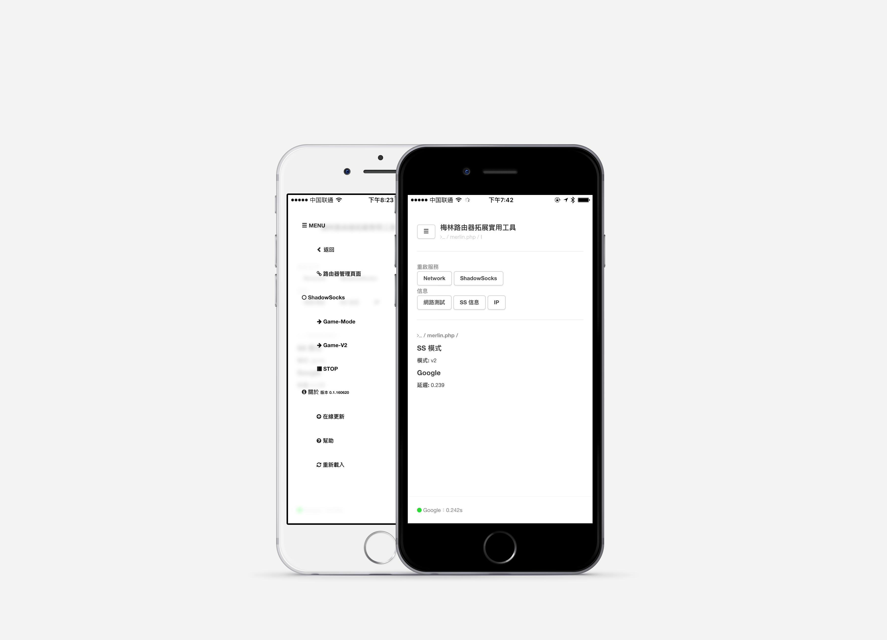
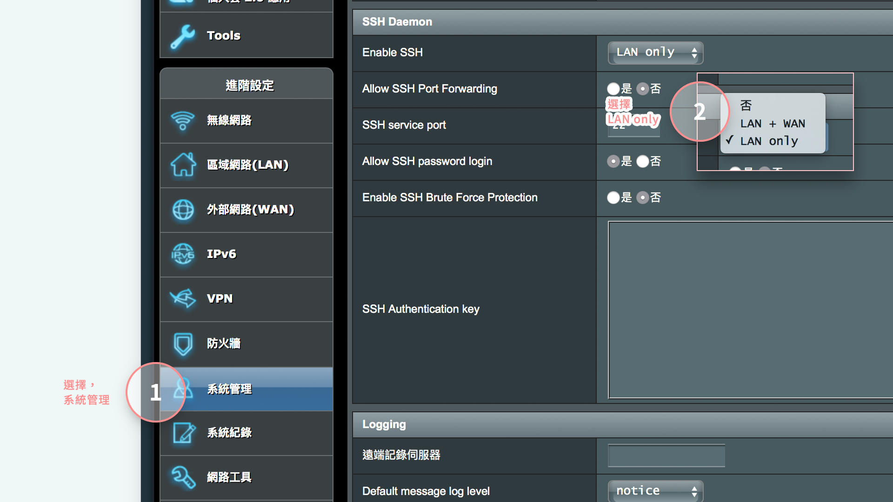

# Merlin.PHP


## 重要說明

* 由於 GitHub 的 SSL 更新，導致低於 **0.6.6** 版本的無法繼續使用 wget 更新內容。請**重新執行一鍵安裝腳本**，將程序安裝到最新版本即可繼續更新了。


##### 下一代的 Merlin UI 計劃。

https://github.com/qoli/Merlin.c


面向 ASUS﹣MERLIN 的 SS Web 管理面板。

只支持 http://koolshare.io 下的固件版本。


##### Dribbble

If u love this, please 'LOVE' on Dribbble.

https://dribbble.com/shots/2786309-Merlin-WEB-Tools

##### Github

And don't forget get me a STAR on github.

Thx ❤️


## User interface





## 功能

為了便捷查看網絡狀態的目的而開發，支持 SS 的重開、以及切換服務器等功能。

* 網絡測試和監視。
* 重新連接網絡（WLAN）。
* 快速重新連接 SS。
* 切換 SS 服務器。


## 開發描述

1. ASUS 的路由器很傻，每次都需要一個難看的後臺，並且輸入賬戶密碼，很煩；
2. Koolshare 的 ASUS 固件的確很好，不過從 UI、操作還是不夠便利；
3. Koolshare 的 SS 重啟速度太慢了。

基於以上三點，故之而個人開發了這個 SS 管理後臺。


很多時候，當國外連線「Problem Detected」的情況下，一般都是 DNSMASQ 服務出了問題。簡單來說，就是你平時能上 QQ 不能打開網頁一樣。我們只需要啟動一下 DNSMASQ 服務就應該可以了。

又有些時候，我們玩 PS4 當和朋友遇到 NAT 限制錯誤時候，這個就需要進行 PPPOE 重新撥號了。

所以，在我的 Web 控制板上，提供了「Network」和「ShadowSocks」兩個重啟按鈕。

**Network：**將會重新連線 WAN，并重啟 DNSMASQ；

**ShadowSocks：**將會重新連接 SS，并重啟 DNSMAQS；


## 開發環境

**OS：** ASUS-MERLIN

**Firmware 固件：** 380.59_X6.6.1

**硬件：** RT-AC68U

**最後測試固件：** 380.66_4-X7.5


# 安裝

安裝需求已經移除下載大師的安裝需求，支持 7.6 版本安裝


## 安裝步驟

##### 在 admin 後臺面板，激活 SSH 功能；




##### 使用你熟悉的工具，登入 SSH

運行安裝腳本

```shell
curl -LO https://github.com/qoli/Merlin.PHP/raw/master/bin/install/install.sh && chmod +x install.sh && ./install.sh
```


# 感謝

- https://www.hqt.ro/lighttpd-web-server-with-php-support-through-optware/
- https://github.com/evilstreak/markdown-js
- Bootstrap
- http://www.bootcdn.cn
- animate.css https://daneden.github.io/animate.css/ 快捷，優秀 CSS3 動畫
- http://www.w3cplus.com/css3/advanced-css-filters.html


# 打包

進入 autoupdate 目錄，運行 `./build.sh`


# SFTP

`ipkg install openssh-sftp-server`
