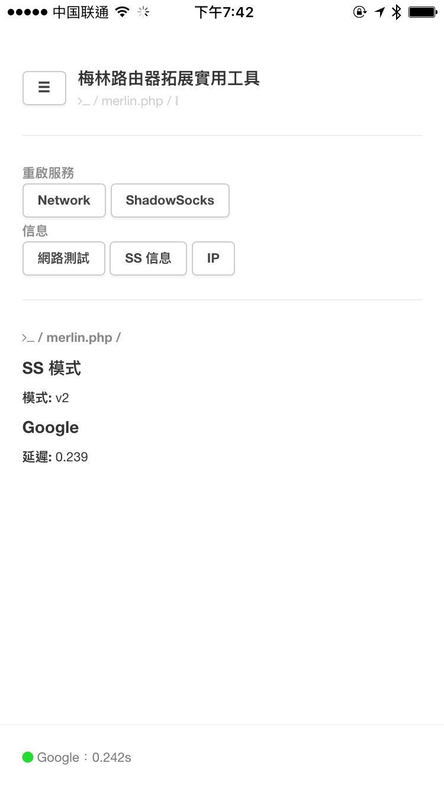

# Merlin.PHP

面向 ASUS﹣MERLIN 的 SS Web 管理面板。

## INSTALL

**環境：** ASUS-MERLIN

**測試：** AC68U

## INSTALL CODE

`ipkg update`

`ipkg upgrade`

`ipkg install lighttpd nano http://www.llqoli.com/ipks/gdbm_1.8.3-4_arm.ipk php-fcgi php-curl`

`sed -i 's/server.port                = 8081/server.port                = 81/g' "/opt/etc/lighttpd/lighttpd.conf"`

`/opt/etc/init.d/S80lighttpd restart`

`app_set_enabled.sh lighttpd yes`

**推薦安裝目錄：**/opt/share/www/

## STEP

1. 在 admin 後臺面板，安裝「Download Master」；
   1. open 'http://192.168.1.1',
   2. select 'USB 相關應用',
   3. Download Master and click 'install' link.
2. 運行上方「**INSTALL CODE**」，以安裝 PHP、Web 服務器相關組件；
3. 打開「http://192.168.1.1:81」，檢查是否已經成功安裝 Web；
4. 釋放源碼到「/opt/share/www/」，記得先清空原來目錄；
5. 刷新「http://192.168.1.1:81」，看到界面即可成功運行。

## UI

## THANK

- https://www.hqt.ro/lighttpd-web-server-with-php-support-through-optware/
- https://github.com/evilstreak/markdown-js
- Bootstrap 
- http://www.bootcdn.cn 
- animate.css https://daneden.github.io/animate.css/ 快捷，優秀 CSS3 動畫
- http://www.w3cplus.com/css3/advanced-css-filters.html

