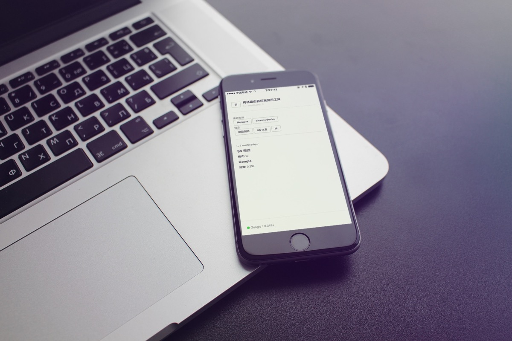

# Merlin.PHP

面向 ASUS﹣MERLIN 的 SS Web 管理面板。

只支持 http://koolshare.io 下的固件版本。

##### Dribbble

If u love this, please 'LOVE' on Dribbble.

https://dribbble.com/shots/2786309-Merlin-WEB-Tools

##### Github

And don't forget get me a STAR on github.

Thx ❤️

## User interface

## 開發描述

1. ASUS 的路由器很傻，每次都需要一個難看的後臺，並且輸入賬戶密碼，很煩；
2. Koolshare 的 ASUS 固件的確很好，不過從 UI、操作還是不夠便利；
3. Koolshare 的 SS 重啟速度太慢了。

基於以上三點，故之而個人開發了這個 SS 管理後臺。

很多時候，當國外連線「Problem Detected」的情況下，一般都是 DNSMASQ 服務出了問題。簡單來說，就是你平時能上 QQ 不能打開網頁一樣。我們只需要啟動一下 DNSMASQ 服務就應該可以了。

又有些時候，我們玩 PS4 當和朋友遇到 NAT 限制錯誤時候，這個就需要進行 PPPOE 重新撥號了。

所以，在我的 Web 控制板上，提供了「Network」和「ShadowSocks」兩個重啟按鈕。

**Network：**將會重新連線 WAN，并重啟 DNSMASQ；

**ShadowSocks：**將會重新連接 SS，并重啟 DNSMAQS；

# 安裝

## 開發環境

**OS：** ASUS-MERLIN

**Firmware 固件：** 380.59_X6.6.1

**硬件：** RT-AC68U

## INSTALL CODE

##### IPKG 更新

`ipkg update`

`ipkg upgrade`

##### 安裝 PHP 環境

`ipkg install lighttpd nano http://www.llqoli.com/ipks/gdbm_1.8.3-4_arm.ipk php-fcgi php-curl`

##### 修改端口

`sed -i 's/server.port                = 8081/server.port                = 81/g' "/opt/etc/lighttpd/lighttpd.conf"`

**重啟 Web**

`/opt/etc/init.d/S80lighttpd restart`

**加入自動運行**

`app_set_enabled.sh lighttpd yes`

**推薦安裝目錄：**/opt/share/www/

## STEP

1. 在 admin 後臺面板，安裝「Download Master」；
	1. open 'http://192.168.1.1',
	2. select 'USB 相關應用',
	3. Download Master and click 'install' link.
2. 運行上方「**INSTALL CODE**」，以安裝 PHP、Web 服務器相關組件；
3. 打開 http://192.168.1.1:81 ，檢查是否已經成功安裝 Web；
4. 釋放源碼到「/opt/share/www/」，記得先清空原來目錄；
5. 刷新 http://192.168.1.1:81 ，看到界面即可成功運行。

# THANK

- https://www.hqt.ro/lighttpd-web-server-with-php-support-through-optware/
- https://github.com/evilstreak/markdown-js
- Bootstrap
- http://www.bootcdn.cn
- animate.css https://daneden.github.io/animate.css/ 快捷，優秀 CSS3 動畫
- http://www.w3cplus.com/css3/advanced-css-filters.html

